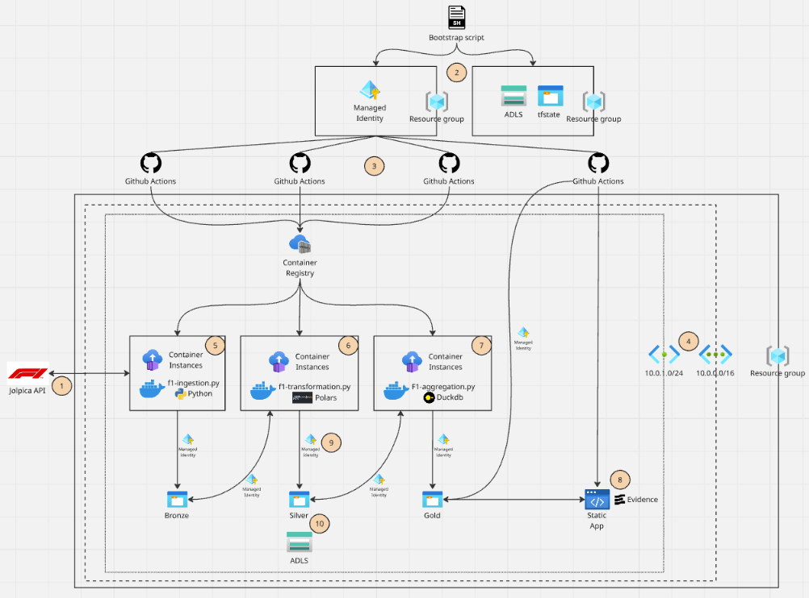

# F1 Data Platform

## Architecture diagram

##  1. F1 Data from Jolpica API

In this data platform I chose a API data source which I think delivers a variaty of data & ai usecases: Formula 1 data. Jolpica API enholds data from drivers, constructors, races, sprints, anything related to formula 1 race weekends and the contenders. For the data platform I chose to work with race results, circuits, drivers, constructors and championship standings. The data set I used contains the seasons 2014 up untill 2025. I chose 2014 as this is the start of the Turbo/Hybrid engine era, next to a rule change around no refuelling during pitstops this is a pretty stable data set looking at race strategy and FIA rules to work with.

## 2. Bootstrap the environment

To setup a foundational Azure layer before being able to execute the terraform code a couple of things need to be set. Terraform needs a place to securly hold its remote backend state(backend.tf) and a secure identity to execute with. The bootstrap script creates 2 resource groups, one for the .tfstate and backend.tf files and another resource group for the managed identity for Terraform to securely connect with Azure via Github Actions OICD(OpenID Connect).

## 3. CICD: Github Actions

Github Actions is my favourite DevOps tool for it's huge community and variaty of options. Microsoft AI platforms tend to chose GH Actions over Azure DevOps aswell with Microsoft vouching for it.

I restraint from using any secrets in GH Actions by using OICD Federated Credentials. Passing traditional passwords or keys into GitHub Repository Secrets introduces rotation overhead and vulnerabilities. By configuring OIDC, Azure explicitly trusts the GitHub Organization and Repository based on short-lived cryptographic tokens mapped to specific branches and environments.

## 4. Networking

I created a scalable terraform setup for the networking layer to use a fully data-driven configuration model. Instead of writing static, hardcoded infrastructure, i use variables, dynamic for_each loops, and decoupled mapping logic to flatten nested arrays. Adding network resources while expanding the platform for future versions is as simple as adding extra variable values.

While the User-Assigned Managed Identities (UAMIs) (ref 9.) handles identity security and acces rights, the networking handles perimeter security, controlling where data can physically travel. 
Next to that the subnets are used to delegating acces to the ACI. ACI is a PaaS software and normally cant be hosted without setting the network up this way.

## 5. Data ingestion(BRONZE)

First a quick note on the setup here. Instead of provisioning heavy, expensive, always-on cluster compute (like Databricks or traditional VMs), I use lightweigt, serverless Azure Container Instances triggered sequentially via GitHub Actions. The ACIs host dockerfiles that run the python scripts who take care of the data processing. 

This ingestion container connects to the Jolpica F1 API and sends 3 requests: Results, driver standings and constructor standings. The Results.json loaded in the bronze layer contains all race, circuit and race_results data needed to build stand-alone silver tables. Whereas I use the standings.json files to quickly get hold of the championship standings so no complex calculations and FIA rule implementations on points over different seasons is needed in loading the silver tables.

## 6. Data transformation(SILVER)

I use Polars as the primary data processing framework for the transformation runtime. More commonly Pandas is used as a populair python package. Pandas is single-threaded and not as memory efficient as Polars. It often requiring 5x to 10x the dataset's size in RAM to execute computations. Polars is written in Rust, utilizes an Apache Arrow memory model under the hood, and executes queries across multiple CPU cores in parallel. This allows the transformations to run very fast while remaining inside low resource usage and low-cost container footprints. Perfect for a personal project where you want to keep costs as low as possible.

## 7. Data aggregation(GOLD)

To stay within the ephameral infrastructure philosophy I chose DuckDB as the query engine. Being able to query within markdown files without provisioning a database server fits the near-0 cost of this platform. DuckDB is serverless and runs in the container that calls it. During the GitHub Actions build phase DuckDB spins up instantly in memory and executes the SQL queries required to generate the dashboard components. Next to that DuckDB has native parquet synergy which works great with the medaillon architecture setup.

## 8. Evidence.dev static web dashboard

Another zero-cost implementation for the platform. Evidence.dev works great with DuckDB source queries. I host the dasboarding solution on Azure's Free SKU tier Static Web Apps engine.

It brings software engineering to Business Intelligence. Evidence uses a markdown and SQL file framework that can be version-controlled in Git and dashboards are created within minutes. Perfect for this platform that will focus more on implementing Agentic AI rather then demostrating dashboarding.

## 9. User-Assigned Managed Identity

I use user-assigned managed identity for each processing step in the medaillon architecture. This follows the secretless connectivity I have setup for this repository. Acces is assigned via RBAC on the UAMIs. User-Assigned Managed Identities fit the ephemeral nature of the platform, as they outlive the resource. Assigning System-Assigned Managed Identities would result in having to reassign data acces roles during every container run.

## 10. Medaillon lakehouse

I structured the storage around distinct storage containers: Bronze (Raw API payloads), Silver (Cleaned, type-casted columnar records), and Gold (Aggregated, business-ready analytical data matrices). Industry standard for so long it doesn't need explaination.

